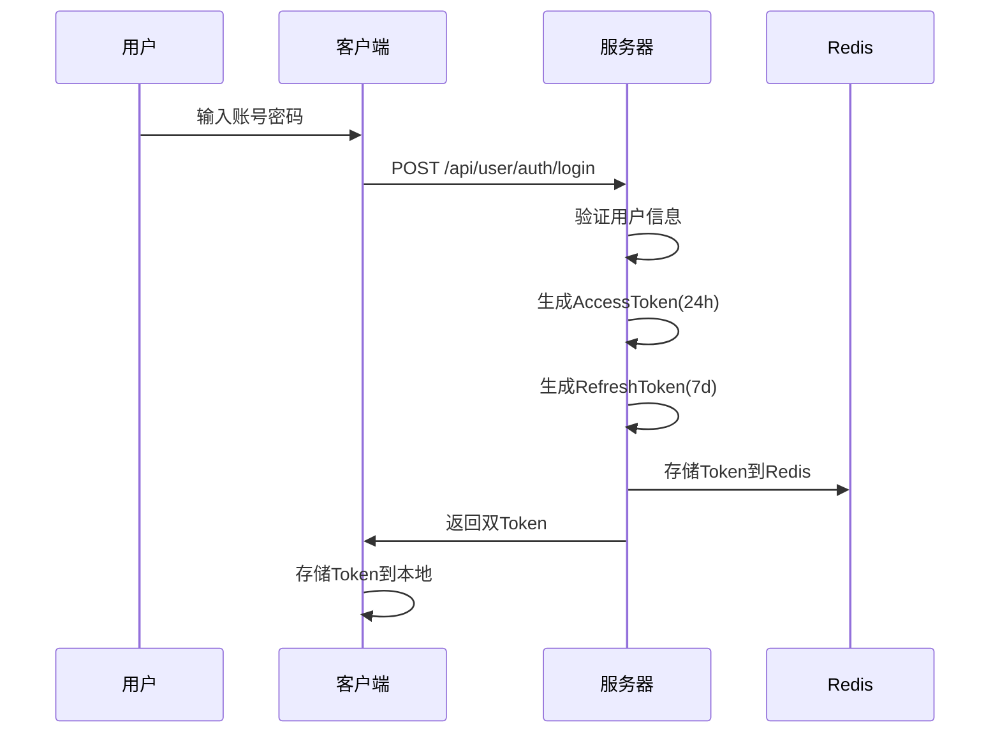
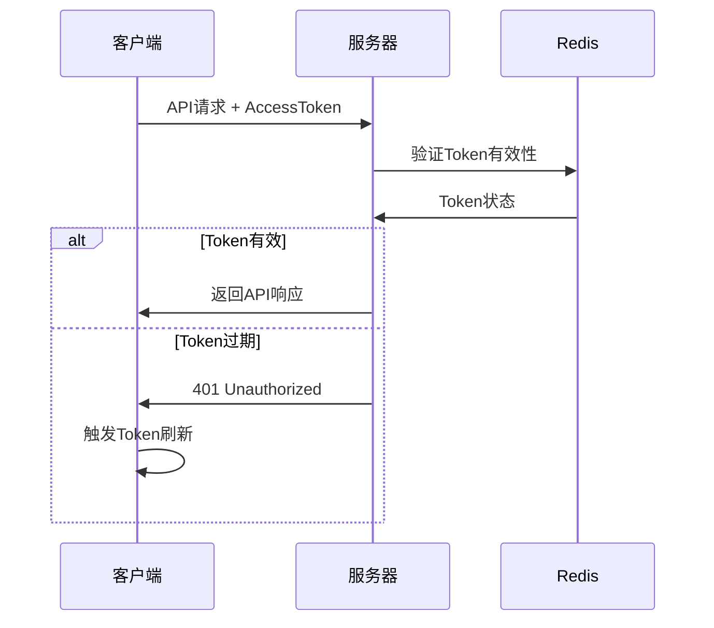
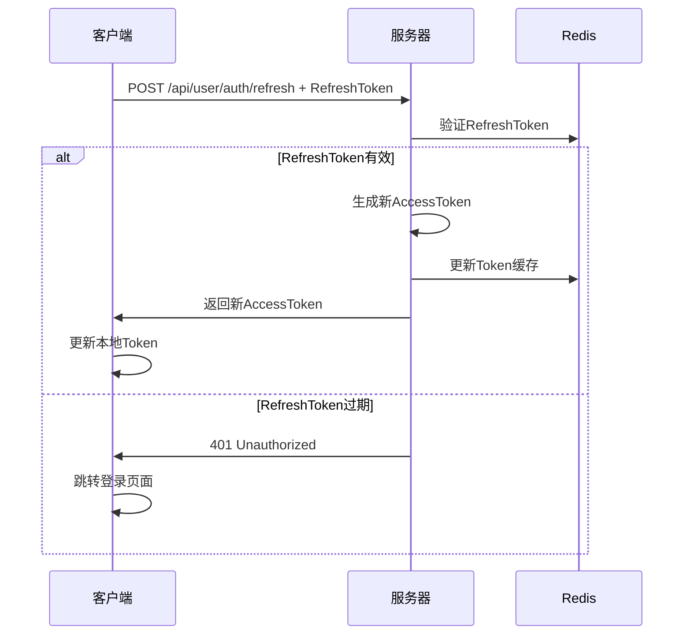

# JWT Token 和 RefreshToken 理想操作逻辑

## 📋 概述

JWT Token系统采用**双Token机制**：AccessToken（访问令牌）+ RefreshToken（刷新令牌），提供安全、高效的认证方案。

## 🎯 核心设计理念

### 1. **安全优先**
- AccessToken短期有效，减少泄露风险
- RefreshToken长期有效，但仅用于刷新
- 支持Token撤销和黑名单机制

### 2. **用户体验**
- 无感知的Token自动刷新
- 减少重复登录频率
- 支持多设备登录管理

### 3. **系统性能**
- Redis缓存Token状态
- 减少数据库查询
- 支持分布式部署

## 🔄 Token生命周期

### 📊 **Token类型对比**

| 类型 | 有效期 | 用途 | 存储位置 | 安全级别 |
|------|--------|------|----------|----------|
| **AccessToken** | 24小时 | API访问 | Redis + 客户端 | 高 |
| **RefreshToken** | 7天 | 刷新AccessToken | Redis + 客户端 | 中 |

### 🚀 **完整流程**

#### 1. **用户登录**


#### 2. **API访问**


#### 3. **Token刷新**


## 🛠️ 实现细节

### 1. **Token生成策略**

```java
// AccessToken - 短期有效
public String generateToken(String userId, String phone) {
    Map<String, Object> claims = new HashMap<>();
    claims.put("userId", userId);
    claims.put("phone", phone);
    claims.put("type", "access");
    claims.put("iat", System.currentTimeMillis()); // 签发时间
    
    return createToken(claims, userId, 24 * 60 * 60 * 1000); // 24小时
}

// RefreshToken - 长期有效
public String generateRefreshToken(String userId) {
    Map<String, Object> claims = new HashMap<>();
    claims.put("userId", userId);
    claims.put("type", "refresh");
    claims.put("iat", System.currentTimeMillis());
    
    return createToken(claims, userId, 7 * 24 * 60 * 60 * 1000); // 7天
}
```

### 2. **Redis存储策略**

```java
// AccessToken存储
String accessKey = "login:token:" + userId;
stringRedisTemplate.opsForValue().set(accessKey, accessToken, 24, TimeUnit.HOURS);

// RefreshToken存储
String refreshKey = "refresh:token:" + userId;
stringRedisTemplate.opsForValue().set(refreshKey, refreshToken, 7, TimeUnit.DAYS);

// Token黑名单（登出时）
String blacklistKey = "blacklist:token:" + tokenHash;
stringRedisTemplate.opsForValue().set(blacklistKey, "1", remainingTime, TimeUnit.MILLISECONDS);
```

### 3. **Token验证逻辑**

```java
public boolean validateToken(String token) {
    try {
        // 1. 检查Token格式
        if (!isValidTokenFormat(token)) {
            return false;
        }
        
        // 2. 检查Token签名
        Claims claims = getClaimsFromToken(token);
        if (claims == null) {
            return false;
        }
        
        // 3. 检查Token过期时间
        if (claims.getExpiration().before(new Date())) {
            return false;
        }
        
        // 4. 检查Token黑名单
        if (isTokenBlacklisted(token)) {
            return false;
        }
        
        // 5. 检查Redis中的Token状态
        String userId = claims.get("userId", String.class);
        String cachedToken = getCachedToken(userId);
        if (!token.equals(cachedToken)) {
            return false;
        }
        
        return true;
    } catch (Exception e) {
        log.error("Token验证失败: {}", e.getMessage());
        return false;
    }
}
```

## 🔐 安全机制

### 1. **Token撤销**
```java
// 用户登出
public void logout(String userId) {
    // 1. 将AccessToken加入黑名单
    String accessToken = getCachedAccessToken(userId);
    addToBlacklist(accessToken);
    
    // 2. 删除Redis中的Token
    deleteCachedTokens(userId);
    
    // 3. 记录登出日志
    log.info("用户登出: userId={}", userId);
}
```

### 2. **多设备管理**
```java
// 支持多设备登录
public void login(String userId, String deviceId) {
    // 1. 生成设备特定的Token
    String deviceToken = generateDeviceToken(userId, deviceId);
    
    // 2. 存储设备Token映射
    String deviceKey = "device:token:" + userId + ":" + deviceId;
    stringRedisTemplate.opsForValue().set(deviceKey, deviceToken, 7, TimeUnit.DAYS);
    
    // 3. 记录设备登录信息
    recordDeviceLogin(userId, deviceId);
}
```

### 3. **异常处理**
```java
// Token刷新失败处理
public Result refreshToken(String refreshToken) {
    try {
        // 1. 验证RefreshToken
        if (!validateRefreshToken(refreshToken)) {
            return Result.fail("刷新Token无效");
        }
        
        // 2. 生成新AccessToken
        String userId = getUserIdFromToken(refreshToken);
        String newAccessToken = generateToken(userId, getPhoneFromToken(refreshToken));
        
        // 3. 更新Redis缓存
        updateTokenCache(userId, newAccessToken);
        
        return Result.ok(Map.of("accessToken", newAccessToken));
        
    } catch (Exception e) {
        log.error("Token刷新失败: {}", e.getMessage());
        return Result.fail("Token刷新失败，请重新登录");
    }
}
```

## 📱 客户端实现

### 1. **自动刷新机制**
```javascript
// 前端Token自动刷新
class TokenManager {
    constructor() {
        this.accessToken = localStorage.getItem('accessToken');
        this.refreshToken = localStorage.getItem('refreshToken');
    }
    
    async refreshAccessToken() {
        try {
            const response = await fetch('/api/user/auth/refresh', {
                method: 'POST',
                headers: {
                    'Authorization': `Bearer ${this.refreshToken}`,
                    'Content-Type': 'application/json'
                }
            });
            
            if (response.ok) {
                const data = await response.json();
                this.accessToken = data.accessToken;
                localStorage.setItem('accessToken', this.accessToken);
                return true;
            } else {
                // RefreshToken也过期了，跳转登录
                this.logout();
                return false;
            }
        } catch (error) {
            console.error('Token刷新失败:', error);
            this.logout();
            return false;
        }
    }
    
    async makeRequest(url, options = {}) {
        // 添加AccessToken到请求头
        options.headers = {
            ...options.headers,
            'Authorization': `Bearer ${this.accessToken}`
        };
        
        let response = await fetch(url, options);
        
        // 如果返回401，尝试刷新Token
        if (response.status === 401) {
            const refreshed = await this.refreshAccessToken();
            if (refreshed) {
                // 重新发送请求
                options.headers['Authorization'] = `Bearer ${this.accessToken}`;
                response = await fetch(url, options);
            }
        }
        
        return response;
    }
}
```

### 2. **Token存储策略**
```javascript
// 安全的Token存储
class SecureTokenStorage {
    // 使用httpOnly cookie存储RefreshToken（更安全）
    setRefreshToken(token) {
        document.cookie = `refreshToken=${token}; path=/; secure; httpOnly; max-age=${7*24*60*60}`;
    }
    
    // 使用localStorage存储AccessToken（便于JS访问）
    setAccessToken(token) {
        localStorage.setItem('accessToken', token);
    }
    
    // 获取Token
    getAccessToken() {
        return localStorage.getItem('accessToken');
    }
    
    getRefreshToken() {
        return this.getCookie('refreshToken');
    }
    
    // 清除Token
    clearTokens() {
        localStorage.removeItem('accessToken');
        document.cookie = 'refreshToken=; path=/; expires=Thu, 01 Jan 1970 00:00:00 GMT';
    }
}
```

## 🚀 最佳实践

### 1. **性能优化**
- ✅ **Redis缓存**：减少数据库查询
- ✅ **Token压缩**：减少网络传输
- ✅ **批量验证**：支持批量Token验证

### 2. **安全增强**
- ✅ **Token轮换**：定期更换RefreshToken
- ✅ **设备绑定**：Token与设备ID绑定
- ✅ **地理位置**：异常登录检测

### 3. **监控告警**
- ✅ **Token使用统计**：监控Token使用频率
- ✅ **异常登录检测**：检测异常登录行为
- ✅ **安全事件记录**：记录所有安全相关事件

## 📊 配置建议

### 1. **生产环境配置**
```properties
# Token有效期配置
jwt.access-token.expiration=24h
jwt.refresh-token.expiration=7d

# Redis配置
spring.redis.timeout=2000ms
spring.redis.lettuce.pool.max-active=8

# 安全配置
jwt.secret-key=your-super-secret-key-here
jwt.blacklist.enabled=true
jwt.device-binding.enabled=true
```

### 2. **开发环境配置**
```properties
# 开发环境Token有效期更长
jwt.access-token.expiration=7d
jwt.refresh-token.expiration=30d

# 禁用某些安全特性
jwt.blacklist.enabled=false
jwt.device-binding.enabled=false
```

---

**总结**：理想的Token操作逻辑应该平衡**安全性**、**用户体验**和**系统性能**，通过双Token机制、Redis缓存、自动刷新等技术手段，提供安全可靠的认证方案。
